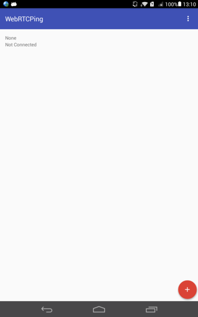
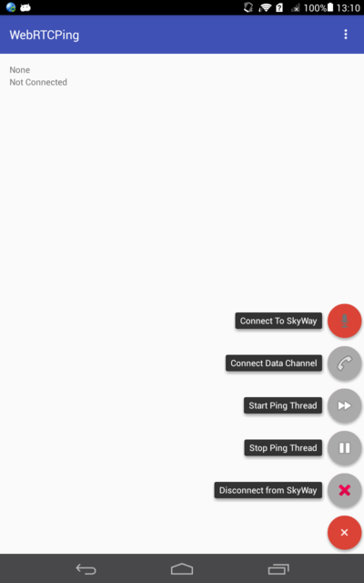
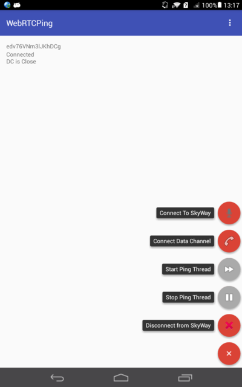
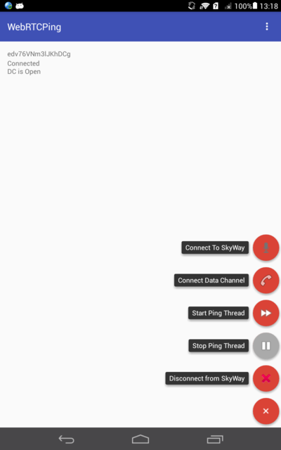
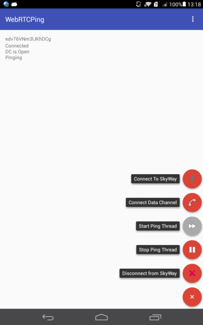

# WebRTC サンプルアプリ

"ping" を秒間120回送信するだけのサンプルアプリ。

## 準備

### Gradleインストール

適当にインストールする。

### SkyWay.aarダウンロード

https://github.com/nttcom/SkyWay-Android-SDK/releases/tag/v0.2.2

↑からダウンロードしたファイルを展開し、app/libs/の下に置く。

### APIキーを書く

https://skyway.io/

に登録し、APIキーを取得後、

app/src/main/java/com/github/yuuichi_fujioka/webrtcping/MainActivity.java

のAPI_KEYに取得したSkyWay用APIキーを書く。

### Android SDK Pathの設定

local.properties の sdk.dir に Android SDKのパスを設定する。
環境変数 ANDROID_HOMEに設定でも良い。

### インストール

利用する端末をPCに接続し、以下のコマンドを実行

```
gradle installDebug
```

ないしは、

```
gradle build
```

を実行し、出来上がった app/build/outputs/apk/app-debug.apk を何とかしてインストールする。

## 使い方

* Android端末が *2台* 必要です

1. アプリ起動後、右下のボタンを押す。（両端末で実施）

 

2. Connect To SkyWay を押す。（両端末で実施）

 

3. Connect Data ChannelがEnableになったら、押す。（片方だけで実施）

 

4. Start Ping Threadを押す。（片方だけで実施）

 

 これで、こっそり裏でping/pongをひたすら送り合うようになる。
 画面では何も見えないので、Android StudioのNetwork Monitorなどで投げ合っていることを確認する。

5. 止めるときはStop Ping Thread を押す。（送信している方で実施）

 

6. Disconnect from SkyWay を押す。（両方で実施）

 
